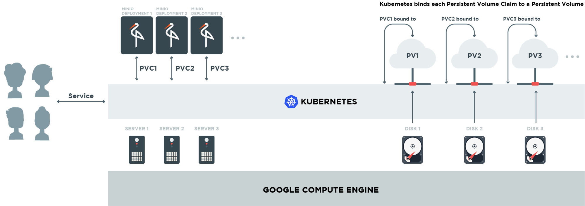

# Build cloud storage on GCP with Minio and Kubernetes

***
** Simple example **
***



1. Lets start with creating a GCE disk.
    ```bash
    gcloud compute disks create minio-1 --size=5GiB
    ```
    Expected output example:
    ```bash
    NAME     ZONE            SIZE_GB  TYPE         STATUS
    minio-1  europe-west1-d  5        pd-standard  READY
    ```
    *OR*
    ```bash
    kubectl create -f minio-gce-pv.yaml
    ```
    Expected output example:
    ```bash
    NAME     ZONE            SIZE_GB  TYPE         STATUS
    minio-1  europe-west1-d  5        pd-standard  READY
    ```
2. Deploying Minio
    ```bash
    kubectl create -f  minio-deployment.yaml
    ```
    Expected output example:
    ```bash
    deployment "minio-deployment" created
    ```